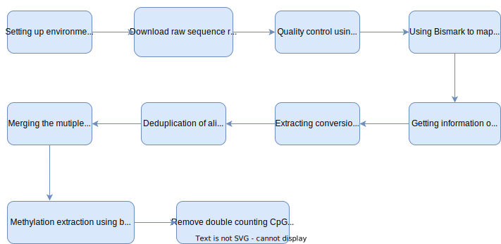

# bisulfite-sequence-data-analysis-pipeline
### A pipeline to preprocess and analyze bisulfite sequence data.


## STEPS

As a prerequisite, conda (anaconda or miniconda) can be installed. Then the following steps can be run within a [virtual environment](https://uoa-eresearch.github.io/eresearch-cookbook/recipe/2014/11/20/conda/) created using conda.

### 1) Configure the paths of the software libraries & packages used

The generic way to add paths to the `PATH` variable is as following:
```sh
export PATH=$PATH:/<PATH_TO_PACKAGE_OR_LIBRARY_FROM_ROOT_FOLDER>
```

### 2) Download the required Sequence Read Archive (SRA) files & convert to FASTQ files (For this installing [sra-tools](https://anaconda.org/bioconda/sra-tools) is required).

Commonly these can be downloaded using Gene Expression Omnibus (GEO) or SRA in NCBI. Refer to [download_sra.slrum](https://github.com/UdithaM/bisulfite-sequence-data-analysis-pipeline/blob/main/download_sra.slrum) which is a sample bash script that can be used for this purpose. This will result in a pair of FASTQ files for each SRA file.

### 3) Quality control using trim_galore software (For this installing [trim-galore](https://anaconda.org/bioconda/trim-galore) is required).

After obtaining adapter sequences for both the forward and reverse reads, `trim_galore` which is a wrapper script can be used to automate quality and adapter trimming as well as quality control. 

This software automatically,
- removes base calls with a Phred score of 20 or lower (assuming Sanger encoding)
- removes any signs of the Illumina adapter sequence from the 3' end (AGATCGGAAGAGC)
- remove sequences that got shorter than 20 bp

Refer to [trim_galore.slrum](https://github.com/UdithaM/bisulfite-sequence-data-analysis-pipeline/blob/main/trim_galore.slrum) which is a sample bash script that can be used for this purpose.

### 4) Using Bismark to map to the reference genome (For this installing [bismark](https://anaconda.org/bioconda/bismark) & [bowtie2](https://anaconda.org/bioconda/bowtie2) are required).

#### 4.1) Prepare the new reference genome using bismark.

Refer to [prepare_ref.slrum](https://github.com/UdithaM/bisulfite-sequence-data-analysis-pipeline/blob/main/prepare_ref.slrum) which is a sample bash script that can be used for this purpose.

#### 4.2) Mapping reads to reference genome using Bismark

Depending on the size of the FASTQ files, they can be split using [seqkit](https://anaconda.org/bioconda/seqkit). Then they can be used for mapping separately resulting in multiple .BAM files.

Description of the parameters used:

-q : The query input files (specified as , or are FASTQ files (usually having extension .fg or .fastq). This is the default.

--bowtie2 : Default: ON. Uses Bowtie 2 instead of Bowtie 1. Bismark limits Bowtie 2 to only perform end-to-end alignments, i.e. searches for alignments involving all read characters (also called untrimmed or unclipped alignments). Bismark assumes that raw sequence data is adapter and/or quality trimmed where appropriate. Both small (.bt2) and large (.bt2l) Bowtie 2 indexes are supported.

-p : This is an option to use parallelization in bowtie2

-B : The base name of the .BAM file generated from the Bismark.

--multicore : this option works when -B is not specified. Use this to set the program to run in parallel.
-1: read 1 fastq file
-2: read 2 fastq file

The complete guide for the options for Bismark can be accessed [here](https://www.bioinformatics.babraham.ac.uk/projects/bismark/Bismark_User_Guide.pdf).

**Note that, if you are planning to use bisSNP later, add the --rg_tag to bismark. The the read groups will be tagged with some information about the sequencing for later use.**

Refer to [mapping.slrum](https://github.com/UdithaM/bisulfite-sequence-data-analysis-pipeline/blob/main/mapping.slrum) which is a sample bash script that can be used for this purpose.

Once the mapping using Bismark is completed, [MultiQC](https://multiqc.info/) can be used to generate a report on the data analysed.

**NOTE: Refer [here](https://multiqc.info/docs/) for the complete documentation of MultiQC.**

#### NOTE: if you are planning to use bisSNP later, add the --rg_tag to bismark. The read groups will be tagged with some information about the sequecing for later use.

#### 4.3) Splitting tha bam file to extract bam files for each chromosome [bamtools](https://anaconda.org/bioconda/bamtools) 

Refer to [splitting.slrum](https://github.com/UdithaM/bisulfite-sequence-data-analysis-pipeline/blob/main/splitting.slrum) which is a sample bash script that can be used for this purpose.

**NOTE: Refer [here](https://hcc.unl.edu/docs/applications/app_specific/bioinformatics_tools/data_manipulation_tools/bamtools/running_bamtools_commands/) for the complete documentation of bamtools commands.**

### 5) Getting information on **insert size**


Following script provides useful metrics for validating library construction including the insert size distribution and read orientation of paired-end libraries.

The expected proportions of these metrics vary depending on the type of library preparation used, resulting from technical differences between pair-end libraries and mate-pair libraries.

The CollectInsertSizeMetrics tool outputs the percentages of read pairs in each of the three orientations (FR, RF, and TANDEM) as a histogram. In addition, the insert size distribution is output as both a histogram (.insert_size_Histogram.pdf) and as a data table (.insert_size_metrics.txt).

**NOTE: Usually input file should be sorted before running the CollectInsertSizeMetrics.**

**NOTE: Metrics labeled as percentages are actually expressed as fractions.**

Refer to [insert_size.slrum](https://github.com/UdithaM/bisulfite-sequence-data-analysis-pipeline/blob/main/insert_size.slrum) which is a sample bash script that can be used for this purpose.

**NOTE: Refer [here](https://gatk.broadinstitute.org/hc/en-us/articles/360037055772-CollectInsertSizeMetrics-Picard-) for the complete documentation of CollectInsertSizeMetrics.**

### 6) Extracting **conversion rate** for each sample

- To estimate bisulfite conversion rate, you need to have DNA that you know is unmethylated added to your sample before bisulfite conversion (for example, our lab adds 1ng lambda phage DNA to ~200ng of our mammalian samples). In that sample, your bisulfite conversion rate is the proportion of Cs converted to Ts (since all Cs are unmethylated and should be converted). 
- This can be estimated from the experimental sample CHG and CHH sites, in which the actual methylation % is close to 0.
- **Conversion Rate** is calculated as (converted/(converted + unconverted))

Refer to [conversion_rate.slrum](https://github.com/UdithaM/bisulfite-sequence-data-analysis-pipeline/blob/main/conversion_rate.slrum) which is a sample bash script that can be used for this purpose.

### 7) Deduplication

**Usually input file should be sorted before running the deduplication.**

Information on installation of [bamtools](https://anaconda.org/bioconda/bamtools) & [picard](https://anaconda.org/bioconda/picard).

This [document](https://raw.githubusercontent.com/wiki/pezmaster31/bamtools/Tutorial_Toolkit_BamTools-1.0.pdf) can be used as a guide for bamtools options.

Refer to [deduplication.slrum](https://github.com/UdithaM/bisulfite-sequence-data-analysis-pipeline/blob/main/deduplication.slrum) which is a sample bash script that can be used for this purpose.

### 8) Merging the mutiple files from the same sample (Optional)

If the data from one sample comes as multiple files, in this step those will be merged.

This [document](https://raw.githubusercontent.com/wiki/pezmaster31/bamtools/Tutorial_Toolkit_BamTools-1.0.pdf) can be used as a guide for bamtools options.

Refer to [merge.slrum](https://github.com/UdithaM/bisulfite-sequence-data-analysis-pipeline/blob/main/merge.slrum) which is a sample bash script that can be used for this purpose.

### 9) Methylation extraction using bismark_methylation_extractor

**Before doing the extraction, BAM files for the selected chromosome from each sample (if they were processed after splitting) must be merged together.**

Potentially important consideration --no_overlap

For paired-end reads it is theoretically possible that Read 1 and Read 2 overlap. This option avoids scoring overlapping methylation calls twice (only methylation calls of read 1 are used for in the process since read 1 has historically higher quality basecalls than read 2).

This is set automatically by the methylation extractor.

Refer to [extraction.slrum](https://github.com/UdithaM/bisulfite-sequence-data-analysis-pipeline/blob/main/extraction.slrum) which is a sample bash script that can be used for this purpose.


### 10) Remove double counting CpGs in forward and backward strands

This step will remove the double counting of the CpGs from forward & backward strands. This can be run on the **unzipped .cov** files resulting from the methylation extraction step.

Refer to [remove_double_count.slrum](https://github.com/UdithaM/bisulfite-sequence-data-analysis-pipeline/blob/main/remove_double_count.slrum) which is a sample bash script that can be used for this purpose.


### Refer to [VTRNA2-1 Figures Replication](https://github.com/UdithaM/bisulfite-sequence-data-analysis-pipeline/blob/main/Replicate_Plots%20(Modified%20Avg).ipynb) to check on the analysis of chr19 coverage data for HF & PBL in C01 & C02.


## License

MIT

